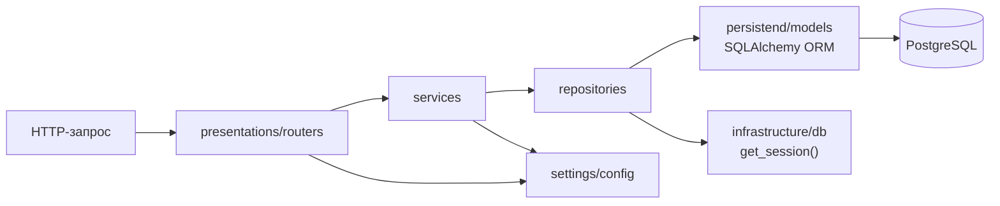
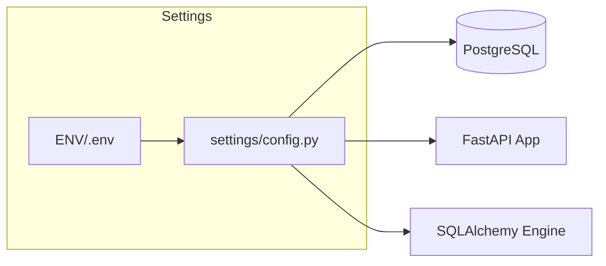
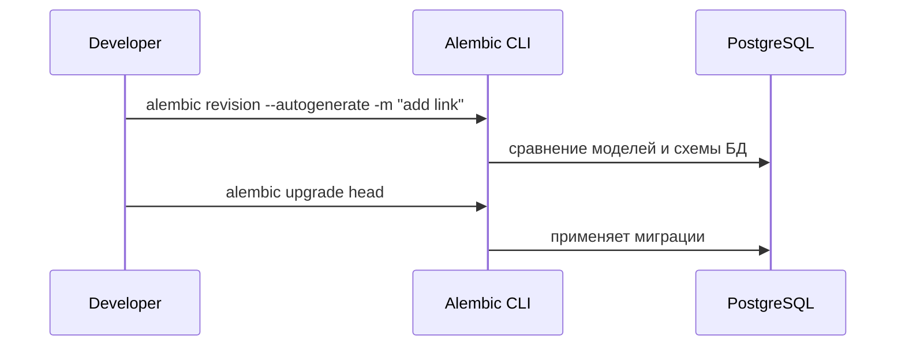

# Clean FastAPI + PostgreSQL Template

Минимальный чистый шаблон бэкенда на **FastAPI** с **PostgreSQL** и асинхронным SQLAlchemy.
Архитектура слоями: `presentations` (API) → `services` (бизнес‑логика) → `repositories` (доступ к БД) → `persistend` (ORM‑модели) → `infrastructure` (подключение БД) → `settings` (настройки).

## Быстрый старт (Docker)

1) Скопируйте `.env.example` → `.env` и при необходимости измените значения.
2) Запустите:
```bash
docker compose up --build
```
3) Проверьте:
- Swagger UI: http://localhost:8000/docs
- Healthcheck: http://localhost:8000/health

## Локально (без Docker)

```bash
python -m venv .venv
source .venv/bin/activate  # Windows: .venv\Scripts\activate
pip install -r backend/requirements.txt
export $(grep -v '^#' .env | xargs)  # либо задайте ENV переменные вручную
uvicorn backend.main:app --reload
```

## Структура

```
backend/
  main.py
  presentations/
    app.py
    routers/health.py
  services/
  repositories/
    base.py
  persistend/
    base.py
    models/
  infrastructure/
    db.py
  settings/
    config.py
  utils/
  requirements.txt
Dockerfile
docker-compose.yml
.env.example
```

## Дальше

- Добавляйте модели в `persistend/models` и запускайте миграции (можно подключить Alembic позже).
- Реализуйте репозитории и сервисы под свою доменную логику.
- Подключайте новые роуты через `presentations/app.py`.

## Backend Architecture — Quick Reference (FastAPI + SQLAlchemy + Postgres)

> Конспект по архитектуре проекта и правилам расширения. Готово для вставки в `README.md`.
>
> Используется стек: **FastAPI**, **SQLAlchemy (async)**, **PostgreSQL**, **pydantic-settings**.

---

## 1) Зачем такая архитектура

- Отделяем HTTP-обвязку от бизнес-логики и SQL.
- Единая точка конфигурации и подключения к БД.
- Понятные границы транзакций (commit/rollback).
- Лёгкое добавление новых сущностей (модели → репозитории → сервисы → роутеры).

---

## 2) Дерево проекта (краткое описание слоёв)

```text
backend/
  main.py                         # точка входа: app = create_app()
  presentations/
    app.py                        # сборка FastAPI, CORS, middleware, startup/shutdown (init_db/dispose_db)
    routers/
      health.py                   # системные ручки: /system/health, /system/version
  services/                       # бизнес-логика: правила, валидации, оркестрация репозиториев
  repositories/
    base.py                       # общий Generic-репозиторий (get/list/add/delete/exists и т.п.)
  persistend/
    base.py                       # Declarative Base + TimestampMixin (created_at/updated_at)
    models/                       # ORM-модели (по одной сущности в файл)
  infrastructure/
    db.py                         # Async SQLAlchemy: engine, sessionmaker, get_session() с commit/rollback
  settings/
    config.py                     # конфиги (Pydantic Settings): .env, CORS, DATABASE_URL, pool params
  utils/                          # вспомогательные функции без побочек
Dockerfile
docker-compose.yml
.env.example
```

---

## 3) Поток данных (кто кого вызывает)



---

## 4) Принципы разделения

- **presentations/** — только HTTP-детали (FastAPI-роуты, Pydantic-схемы).
- **services/** — бизнес-правила, валидации, оркестрация нескольких репозиториев.
- **repositories/** — SQL и доступ к данным (никакой бизнес-логики).
- **persistend/** — ORM-модели и общие базовые классы.
- **infrastructure/** — интеграции и тех. детали (БД, кэш, очереди и т.д.).
- **settings/** — конфиги (.env → Settings).
- **utils/** — вспомогательные идемпотентные функции.

---

## 5) Транзакции и сессии

- Одна операция/HTTP-запрос → **одна `AsyncSession`**.
- Используем контекстный менеджер:

  ```python
  async with get_session() as s:
      # делаем изменения/чтение
  # внутри блока:
  #   без исключений → COMMIT
  #   с исключением  → ROLLBACK (ошибка пробрасывается выше)
  ```

- Репозитории **не коммитят** (делают `flush()` при необходимости ID/defaults). Commit/rollback осуществляет `get_session()`.

---

## 6) Настройки и CORS

- Все конфиги в `settings/config.py` (pydantic-settings).
- CORS: передавайте в `app.add_middleware(CORSMiddleware, allow_origins=settings.CORS_ORIGINS_LIST, ...)`.
- Строка подключения к БД: `settings.database_url` (берётся из `DATABASE_URL` или собирается из `POSTGRES_*`).



---

## 7) Системные эндпоинты

- `GET /system/health` — «жив ли процесс» (не трогает БД).
- `GET /system/version` — имя/версия/окружение.
- (Опционально) `GET /system/ready` — проверка доступности БД (см. пример в `health.py`).

---

## 8) Как добавить новую сущность — пошагово

**Шаг 1 — Модель (ORM)**  
`backend/persistend/models/<entity>.py`

```python
import uuid
from sqlalchemy.orm import Mapped, mapped_column
from sqlalchemy import String, Text
from backend.persistend.base import Base, TimestampMixin

class Link(TimestampMixin, Base):
    id: Mapped[uuid.UUID] = mapped_column(primary_key=True, default=uuid.uuid4)
    short: Mapped[str] = mapped_column(String(16), unique=True, index=True)
    long: Mapped[str] = mapped_column(Text(), nullable=False)
```

**Шаг 2 — Репозиторий**  
`backend/repositories/links.py`

```python
from sqlalchemy.ext.asyncio import AsyncSession
from sqlalchemy import select
from backend.repositories.base import BaseRepository
from backend.persistend.models.link import Link

class LinkRepository(BaseRepository[Link]):
    def __init__(self, session: AsyncSession):
        super().__init__(session, Link)

    async def get_by_short(self, code: str) -> Link | None:
        res = await self.session.execute(select(Link).where(Link.short == code).limit(1))
        return res.scalars().first()
```

**Шаг 3 — Сервис (бизнес-логика)**  
`backend/services/links.py`

```python
from backend.infrastructure.db import get_session
from backend.repositories.links import LinkRepository
from backend.persistend.models.link import Link

async def create_link(short: str, long: str) -> Link:
    async with get_session() as s:
        repo = LinkRepository(s)
        if await repo.get_by_short(short):
            raise ValueError("short already exists")
        link = Link(short=short, long=long)
        await repo.add(link)   # commit произойдёт в get_session()
        return link
```

**Шаг 4 — Роутер (HTTP-слой)**  
`backend/presentations/routers/links.py`

```python
from fastapi import APIRouter, HTTPException, status
from pydantic import BaseModel
from backend.services.links import create_link

router = APIRouter(prefix="/links", tags=["links"])

class LinkCreate(BaseModel):
    short: str
    long: str

class LinkOut(BaseModel):
    id: str
    short: str
    long: str

@router.post("", response_model=LinkOut, status_code=status.HTTP_201_CREATED)
async def create(payload: LinkCreate):
    try:
        link = await create_link(payload.short, payload.long)
        return LinkOut.model_validate(link)
    except ValueError as e:
        raise HTTPException(status.HTTP_409_CONFLICT, str(e))
```

**Шаг 5 — Подключить роутер**  
`backend/presentations/app.py`:

```python
from backend.presentations.routers.links import router as links_router
app.include_router(links_router)
```

---

## 9) Нейминг и конвенции

- Файлы по сущностям: `user.py`, `link.py` (единственное число).
- PK по умолчанию — UUID (удобно для шардирования и импортов).
- Время — через `TimestampMixin` (UTC предпочтительно).
- Pydantic-схемы можно держать в роутере или вынести в `presentations/schemas/<entity>.py`, если их много.

---

## 10) Ошибки и ответы

- В **сервисах** бросайте доменные исключения (`ValueError`, свои `DomainError`).
- В **роутерах** маппьте их на `HTTPException` с корректными статусами (404/409/422/...).
- Не пропускайте raw SQL-ошибки наружу без нормального текста/статуса.

---

## 11) Миграции

- Dev: временно можно включить `Base.metadata.create_all()` в `init_db()`.
- Prod: используйте **Alembic** (инициализация, ревизии, апгрейды).



---

## 12) Запуск

```bash
cp .env.example .env
docker compose up --build
# Swagger: http://localhost:8000/docs
# Health:  http://localhost:8000/system/health
```

---

## 13) Чек-лист при добавлении фичи

- [ ] ORM-модель в `persistend/models`.
- [ ] Репозиторий с запросами в `repositories`.
- [ ] Сервис с бизнес-правилами в `services`.
- [ ] Роутер + схемы в `presentations/routers` (+ подключить в `app.py`).
- [ ] Проверить в Swagger (`/docs`).
- [ ] (Prod) создать и прогнать миграцию Alembic.
