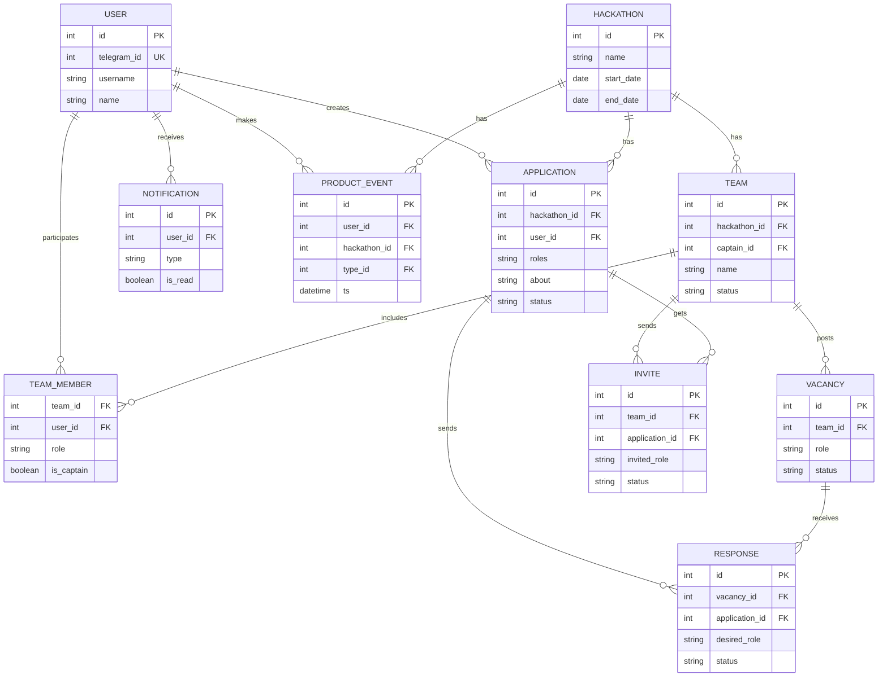

# Teamfinder — Backend & SQL DB (PostgreSQL)

## Содержание
- [1. Описание продукта и цели](#1-описание-продукта-и-цели)
- [2. Подход: Telegram Mini App](#2-подход-telegram-mini-app)
- [3. Модель предметной области](#3-модель-предметной-области)
- [4. ER-диаграмма (Mermaid)](#4-er-диаграмма-mermaid)
- [5. Бизнес-правила и инварианты](#5-бизнес-правила-и-инварианты)
- [6. Что внутри репозитория](#6-что-внутри-репозитория)
- [7. Быстрый старт (Docker)](#7-быстрый-старт-docker)
- [8. Структура проекта](#8-структура-проекта)
- [9. DDL/SQL: где смотреть](#9-ddlsql-где-смотреть)
- [10. Метрики и аналитика (DAU/MAU и др.)](#10-метрики-и-аналитика-daumau-и-др)
- [11. Пользовательские потоки и BPMN-заметки](#11-пользовательские-потоки-и-bpmn-заметки)
- [12. Frontend архитектура: Feature-Sliced Design](#12-frontend-архитектура-feature-sliced-design)
- [13. Справочник полей по сущностям](#13-справочник-полей-по-сущностям)
- [14. Backlog / MVP](#14-backlog--mvp)

---

## 1. Описание продукта и цели

**Проблема.** Участникам хакатонов сложно быстро собирать команды — поиск по чатам Telegram шумный и медленный. Организаторы теряют участников и качество решений.

**Гипотеза.** Сервис **Teamfinder** упрощает формирование команд под конкретный хакатон: участники быстрее находят друг друга, организаторы получают больше сильных заявок.

**ЦА.** Студенты и джуны/мидлы без стабильной команды, а также организаторы хакатонов.

---

## 2. Подход: Telegram Mini App

- **UI:** WebApp внутри бота (нативные `BackButton`, темы, авторизация через `initData`).
- **Auth/безопасность:** валидация `initData` на бэкенде (HMAC-SHA256). Можно работать без cookie/JWT; при желании выдаём короткий JWT.
- **Хранение:** `telegram_id`, `username`, `language_code`, `avatar_url` (опц.).
- **Бот = нотификации + диплинки:** deep links `startapp=hackathon:<id>|vacancy:<id>|invite:<id>`.
- **Админка (MVP):** команды бота `/admin` + простые формы в Mini App; полноценную панель можно позже.

---

## 3. Модель предметной области

- **User** — постоянные данные и skill-профиль.
- **Hackathon** — рамки события; все ограничения действуют внутри него.
- **Application** — анкета пользователя под конкретный хакатон (`desired_roles`).
- **Team / TeamMember** — команда и членство; роль фиксируется при присоединении.
- **Vacancy** — открытая позиция в команде; на неё отправляется **Response**.
- **Response** — «я откликнулся на вакансию». При `accepted` создаётся `TeamMember`, прочие предложения закрываются.
- **Invite** — «команда пригласила меня». При `accepted` — то же.
- **Notification** — оповещения на каждом шаге.

---

## 4. ER-диаграмма (Mermaid)

> Диаграмма использует упрощённые типы (`int`, `string`, `date`, `datetime`) для корректного рендера; в реальной схеме это `bigint`, `text`, `date/timestamptz` и т.д.



---

## 5. Бизнес-правила и инварианты

- **1 анкета на хакатон:** `Application` уникальна в паре (`user_id`, `hackathon_id`).
- **1 команда на хакатон:** один `User` не может состоять более чем в одной команде внутри одного `Hackathon`.  
  Гарантируется триггером на `team_member` (и может быть усилено `UNIQUE(user_id, hackathon_id)` при денормализации).
- **Accept → членство:** при `accepted` (`Invite` или `Response`) создаётся `TeamMember`, анкету скрываем/помечаем `joined`, прочие предложения в этом хаке закрываем, шлём нотификации. Всё — атомарно.
- **Статусы:**  
  `Application: draft → published ↔ hidden`  
  `Vacancy: open ↔ closed`  
  `Invite: pending → accepted | rejected | expired`  
  `Response: pending → accepted | rejected | withdrawn`
- **Права:** капитан управляет составом/вакансиями/инвайтами; участник — своей анкетой и откликами; админ — CRUD хакатонов и модерация.

---

## 6. Что внутри репозитория

- `docs/conceptual.md` — концептуальная модель.
- `docs/logical.md` — логическая модель (Mermaid ER).
- `sql/initdb/*.sql` — физическая модель: типы, таблицы, индексы, триггеры, словари, сиды.
- `sql/analytics/queries.sql` — готовые метрики (DAU/MAU, конверсия, fill rate, time-to-join, retention).
- `infra/docker-compose.yml` — локальный Postgres с авто-инициализацией из `sql/initdb`.
- `LICENSE` — MIT.

---

## 7. Быстрый старт (Docker)

```bash
cd infra
docker compose up -d
docker compose logs -f db
```

Подключение:
- Host: `localhost`
- Port: `5432`
- DB: `teamfinder`
- User: `postgres`
- Password: `postgres`

psql:
```bash
docker exec -it teamfinder-db psql -U postgres -d teamfinder
```

---

## 8. Структура проекта

```
teamfinder/
  docs/
    conceptual.md
    logical.md
  infra/
    docker-compose.yml
  sql/
    initdb/
      01_types.sql
      02_tables_core.sql
      03_tables_norm.sql
      04_indexes.sql
      05_triggers.sql
      06_seed_dicts.sql
      # опционально:
      07_seed_data.sql
      08_views.sql
      09_procedures.sql
      10_toast_and_retention.sql
      11_analytics_seed.sql
    analytics/
      queries.sql
LICENSE
README.md
```

> **Обязательный минимум:** `01–06`. Остальные — опциональны (демо-данные, вьюхи, процедуры, компрессия/ретеншн, сиды событий).

---

## 9. DDL/SQL: где смотреть

- Полная схема (`ENUM`, таблицы, индексы, триггеры) находится в `sql/initdb/01–05`.  
- Справочники ролей/скиллов/soft-skills и M2M-связки — `03_tables_norm.sql`, сиды — `06_seed_dicts.sql`.  
- Процедуры `accept_invite/accept_response` (атомарные транзакции) — `09_procedures.sql` *(опционально)*.  
- Компрессия LZ4 TOAST + функции ретеншна — `10_toast_and_retention.sql` *(опционально)*.

---

## 10. Метрики и аналитика (DAU/MAU и др.)

- Событийная таблица: `event_type`, `product_event`.  
- Примеры запросов: `sql/analytics/queries.sql` — **DAU/MAU**, конверсия publish→join, **time-to-join**, **fill rate** вакансий, **retention** (D1/D7/D30), оконные функции/CTE.

---

## 11. Пользовательские потоки и BPMN-заметки

- **Нотификации (минимум):** создание/принятие/отклонение `Invite`/`Response`, вступление/выход, передача капитанства; напоминания до старта/закрытия регистрации.
- **Формирование команд:** на MVP допускается ручное распределение админом поверх пользовательских потоков.
- **UX-дополнения:** явный выход/кик, передача капитана, статус `Team.ready`.

---

## 12. Frontend архитектура: Feature-Sliced Design

Слои: `app` (инициализация), `pages`, `widgets`, `features` (сценарии), `entities` (доменные сущности), `shared` (утилиты/базовые компоненты).

Примеры модулей:
- `entities/user`, `entities/hackathon`, `entities/team`
- `features/respond-to-vacancy`, `features/invite-user`, `features/accept-invite`
- `widgets/team-dashboard`, `widgets/hackathon-header`

---

## 13. Справочник полей по сущностям

**User:** `id, telegram_id(unique), username?, name, surname?, language_code?, avatar_url?, age?, city?, university?, skills[], soft_skills[]?, achievements[]?, portfolio_link?, links{github?,site?,tg?}, bio?, created_at, updated_at`

**Hackathon:** `id, name, description?, start_date, end_date, registration_end_date?, mode('online'|'offline'|'hybrid'), city?, team_members_minimum?, team_members_limit?, registration_link?, prize_fund?, status('draft'|'open'|'closed'), created_at, updated_at`

**Application:** `id, hackathon_id->Hackathon, user_id->User (unique вместе), roles[], about?, status('draft'|'published'|'hidden'), joined:boolean, created_at, updated_at`

**Team:** `id, hackathon_id->Hackathon, captain_id->User, name, description?, links?, status('forming'|'ready'), created_at, updated_at`

**TeamMember:** `team_id->Team, user_id->User (PK вместе), role, is_captain:boolean, joined_at`

**Vacancy:** `id, team_id->Team, role, description?, skills[]?, seniority?, status('open'|'closed'), created_at, updated_at`

**Invite (Team→Application):** `id, team_id->Team, application_id->Application, invited_role, message?, status('pending'|'accepted'|'rejected'|'expired'), expires_at?, created_at`

**Response (Application→Vacancy):** `id, vacancy_id->Vacancy, application_id->Application, desired_role, message?, status('pending'|'accepted'|'rejected'|'withdrawn'), created_at`

**Notification:** `id, user_id->User, type, payload:jsonb, channel('tg'|'in_app'), is_read:boolean, created_at`

---

## 14. Backlog / MVP

**Must-have (MVP):**
- Авторизация через Telegram; список хакатонов.
- Анкета (`Application`) и её публикация.
- Команда (`Team`), капитан, набор.
- Вакансии (`Vacancy`), отклики (`Response`) и инвайты (`Invite`).
- Уведомления/подтверждения; запрет второй команды на тот же хак.
- Простая админка (распределение, CRUD хакатонов).

**Nice-to-have:**
- Рекомендации (матчинг по навыкам), артефакты проектов, рефералки, приглашение в команду по ссылке.
