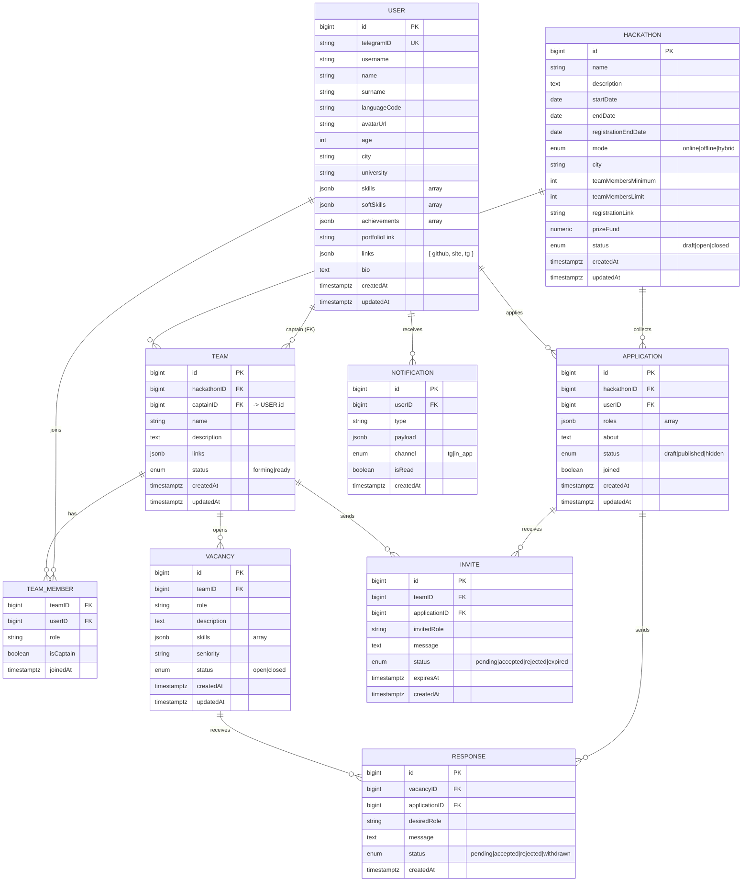

# Teamfinder — README

> Единый документ, объединяющий концепцию продукта, бизнес‑правила, модель данных, ER‑диаграмму, DDL PostgreSQL, подход с Telegram Mini App, BPMN‑штрихи, FSD‑архитектуру фронтенда и справочник полей.

## Содержание
- [1. Описание продукта и цели](#1-описание-продукта-и-цели)
- [2. Подход: Telegram Mini App](#2-подход-telegram-mini-app)
- [3. Модель предметной области](#3-модель-предметной-области)
- [4. ER‑диаграмма (mermaid)](#4-er-диаграмма-mermaid)
- [5. DDL PostgreSQL](#5-ddl-postgresql)
- [6. Бизнес‑правила и инварианты](#6-бизнес-правила-и-инварианты)
- [7. Пользовательские потоки и BPMN‑заметки](#7-пользовательские-потоки-и-bpmn-заметки)
- [8. Frontend архитектура: Feature‑Sliced Design](#8-frontend-архитектура-feature-sliced-design)
- [9. Справочник полей по сущностям](#9-справочник-полей-по-сущностям)
- [10. Backlog / MVP](#10-backlog--mvp)

---

## 1. Описание продукта и цели

**Проблема.** Участникам хакатонов сложно оперативно собирать команды — поиск по чатам Telegram шумный и медленный. Организаторы теряют в вовлечённости и качестве решений.

**Гипотеза продукта.** Сервис **Teamfinder** упрощает формирование команд под конкретный хакатон: участники быстрее находят друг друга, организаторы получают больше сильных заявок.

**ЦА.** Студенты и джуны/мидлы без стабильной команды, а также организаторы хакатонов.

---

## 2. Подход: Telegram Mini App

- **UI:** WebApp внутри бота (нативные `BackButton`, тема, авторизация через `initData`).
- **Auth/безопасность:** валидация `initData` на бэкенде (HMAC‑SHA256). Можно работать вообще без cookie/JWT, используя `initData` как доверенную сессию; при желании выдаём короткий JWT.
- **Хранение:** `tg_id`, `username`, `language_code`, `photo_url` (опционально).
- **Бот = нотификации + диплинки:** личные сообщения/инбокс; deep links вида `startapp=hackathon:<id> | vacancy:<id> | invite:<id>`.
- **Админка (MVP):** команды бота `/admin` и простые формы в Mini App; полноценную веб‑панель можно добавить позднее.

---

## 3. Модель предметной области

- **User** — постоянные данные и общий skill‑профиль (вне событий).
- **Hackathon** — рамки события; все ограничения действуют внутри него.
- **Application** — «моя анкета на конкретный хакатон» + `desired_roles`; скрывается при вступлении.
- **Team** / **TeamMember** — команда и членство; роль фиксируется при присоединении.
- **Vacancy** — запрос команды на роль; на неё отправляется **Response**.
- **Response** — поток «я откликнулся на вакансию». `accepted` капитаном ⇒ создаётся `TeamMember`, прочие предложения закрываются.
- **Invite** — поток «команда пригласила меня». `accepted` пользователем ⇒ аналогично Response.
- **Notification** — оповещения обеим сторонам на каждом шаге.

---

## 4. ER‑диаграмма (mermaid)



---

## 5. DDL PostgreSQL

<details>
<summary>Полная схема (ENUMы, таблицы, индексы, триггер)</summary>

```sql
-- === ENUMS ===
DO $ BEGIN
  CREATE TYPE hackathon_mode AS ENUM ('online','offline','hybrid');
EXCEPTION WHEN duplicate_object THEN NULL; END $;

DO $ BEGIN
  CREATE TYPE hackathon_status AS ENUM ('draft','open','closed');
EXCEPTION WHEN duplicate_object THEN NULL; END $;

DO $ BEGIN
  CREATE TYPE team_status AS ENUM ('forming','ready');
EXCEPTION WHEN duplicate_object THEN NULL; END $;

DO $ BEGIN
  CREATE TYPE application_status AS ENUM ('draft','published','hidden');
EXCEPTION WHEN duplicate_object THEN NULL; END $;

DO $ BEGIN
  CREATE TYPE vacancy_status AS ENUM ('open','closed');
EXCEPTION WHEN duplicate_object THEN NULL; END $;

DO $ BEGIN
  CREATE TYPE invite_status AS ENUM ('pending','accepted','rejected','expired');
EXCEPTION WHEN duplicate_object THEN NULL; END $;

DO $ BEGIN
  CREATE TYPE response_status AS ENUM ('pending','accepted','rejected','withdrawn');
EXCEPTION WHEN duplicate_object THEN NULL; END $;

DO $ BEGIN
  CREATE TYPE notif_channel AS ENUM ('tg','in_app');
EXCEPTION WHEN duplicate_object THEN NULL; END $;

-- === TABLES ===

CREATE TABLE IF NOT EXISTS "user" (
  id              BIGSERIAL PRIMARY KEY,
  telegram_id     BIGINT UNIQUE NOT NULL,
  username        TEXT,
  name            TEXT,
  surname         TEXT,
  language_code   TEXT,
  avatar_url      TEXT,

  age             INT,
  city            TEXT,
  university      TEXT,

  skills          JSONB DEFAULT '[]'::jsonb,       -- ["python","react"]
  soft_skills     JSONB DEFAULT '[]'::jsonb,
  achievements    JSONB DEFAULT '[]'::jsonb,       -- ["winner '23", ...]
  portfolio_link  TEXT,
  links           JSONB DEFAULT '{}'::jsonb,       -- {github, site, tg}
  bio             TEXT,

  created_at      TIMESTAMPTZ NOT NULL DEFAULT now(),
  updated_at      TIMESTAMPTZ NOT NULL DEFAULT now()
);

CREATE TABLE IF NOT EXISTS hackathon (
  id                   BIGSERIAL PRIMARY KEY,
  name                 TEXT NOT NULL,
  description          TEXT,
  start_date           TIMESTAMPTZ NOT NULL,
  end_date             TIMESTAMPTZ NOT NULL,
  registration_end_date TIMESTAMPTZ,
  mode                 hackathon_mode NOT NULL DEFAULT 'online',
  city                 TEXT,
  team_members_minimum INT,
  team_members_limit   INT,
  registration_link    TEXT,
  prize_fund           TEXT,
  status               hackathon_status NOT NULL DEFAULT 'open',
  created_at           TIMESTAMPTZ NOT NULL DEFAULT now(),
  updated_at           TIMESTAMPTZ NOT NULL DEFAULT now()
);

CREATE TABLE IF NOT EXISTS application (
  id            BIGSERIAL PRIMARY KEY,
  hackathon_id  BIGINT NOT NULL REFERENCES hackathon(id) ON DELETE CASCADE,
  user_id       BIGINT NOT NULL REFERENCES "user"(id) ON DELETE CASCADE,
  roles         JSONB  NOT NULL,                     -- ["backend","frontend"]
  about         TEXT,
  status        application_status NOT NULL DEFAULT 'published',
  joined        BOOLEAN NOT NULL DEFAULT FALSE,
  created_at    TIMESTAMPTZ NOT NULL DEFAULT now(),
  updated_at    TIMESTAMPTZ NOT NULL DEFAULT now(),
  CONSTRAINT roles_is_array CHECK (jsonb_typeof(roles) = 'array'),
  CONSTRAINT app_unique_per_hack UNIQUE (hackathon_id, user_id)
);

CREATE TABLE IF NOT EXISTS team (
  id             BIGSERIAL PRIMARY KEY,
  hackathon_id   BIGINT NOT NULL REFERENCES hackathon(id) ON DELETE CASCADE,
  captain_id     BIGINT NOT NULL REFERENCES "user"(id),
  name           TEXT NOT NULL,
  description    TEXT,
  links          JSONB DEFAULT '{}'::jsonb,          -- {repo, chat, ...}
  status         team_status NOT NULL DEFAULT 'forming',
  created_at     TIMESTAMPTZ NOT NULL DEFAULT now(),
  updated_at     TIMESTAMPTZ NOT NULL DEFAULT now()
);

CREATE TABLE IF NOT EXISTS team_member (
  team_id     BIGINT NOT NULL REFERENCES team(id) ON DELETE CASCADE,
  user_id     BIGINT NOT NULL REFERENCES "user"(id) ON DELETE CASCADE,
  role        TEXT NOT NULL,
  is_captain  BOOLEAN NOT NULL DEFAULT FALSE,
  joined_at   TIMESTAMPTZ NOT NULL DEFAULT now(),
  PRIMARY KEY (team_id, user_id)
);

CREATE TABLE IF NOT EXISTS vacancy (
  id           BIGSERIAL PRIMARY KEY,
  team_id      BIGINT NOT NULL REFERENCES team(id) ON DELETE CASCADE,
  role         TEXT NOT NULL,                        -- одна роль на вакансию (MVP)
  description  TEXT,
  skills       JSONB DEFAULT '[]'::jsonb,
  seniority    TEXT,
  status       vacancy_status NOT NULL DEFAULT 'open',
  created_at   TIMESTAMPTZ NOT NULL DEFAULT now(),
  updated_at   TIMESTAMPTZ NOT NULL DEFAULT now()
);

CREATE TABLE IF NOT EXISTS invite (
  id             BIGSERIAL PRIMARY KEY,
  team_id        BIGINT NOT NULL REFERENCES team(id) ON DELETE CASCADE,
  application_id BIGINT NOT NULL REFERENCES application(id) ON DELETE CASCADE,
  invited_role   TEXT NOT NULL,
  message        TEXT,
  status         invite_status NOT NULL DEFAULT 'pending',
  expires_at     TIMESTAMPTZ,
  created_at     TIMESTAMPTZ NOT NULL DEFAULT now()
);

CREATE TABLE IF NOT EXISTS response (
  id             BIGSERIAL PRIMARY KEY,
  vacancy_id     BIGINT NOT NULL REFERENCES vacancy(id) ON DELETE CASCADE,
  application_id BIGINT NOT NULL REFERENCES application(id) ON DELETE CASCADE,
  desired_role   TEXT NOT NULL,
  message        TEXT,
  status         response_status NOT NULL DEFAULT 'pending',
  created_at     TIMESTAMPTZ NOT NULL DEFAULT now()
);

CREATE TABLE IF NOT EXISTS notification (
  id         BIGSERIAL PRIMARY KEY,
  user_id    BIGINT NOT NULL REFERENCES "user"(id) ON DELETE CASCADE,
  type       TEXT NOT NULL,
  channel    notif_channel NOT NULL DEFAULT 'in_app',
  payload    JSONB DEFAULT '{}'::jsonb,
  is_read    BOOLEAN NOT NULL DEFAULT FALSE,
  created_at TIMESTAMPTZ NOT NULL DEFAULT now()
);

-- === INDEXES (полезные для запросов) ===
CREATE INDEX IF NOT EXISTS idx_app_hack_status ON application (hackathon_id, status);
CREATE INDEX IF NOT EXISTS idx_team_hack ON team (hackathon_id);
CREATE INDEX IF NOT EXISTS idx_vac_team_status ON vacancy (team_id, status);
CREATE INDEX IF NOT EXISTS idx_notif_user_unread ON notification (user_id, is_read);

-- === RULE: один пользователь в одной команде на один хакатон ===
-- реализуем через BEFORE INSERT триггер на team_member
CREATE OR REPLACE FUNCTION fn_check_one_team_per_hack()
RETURNS TRIGGER AS $$
DECLARE
  existing_count INT;
  target_hack_id BIGINT;
BEGIN
  SELECT hackathon_id INTO target_hack_id FROM team WHERE id = NEW.team_id;

  SELECT COUNT(*) INTO existing_count
  FROM team_member tm
  JOIN team t ON t.id = tm.team_id
  WHERE tm.user_id = NEW.user_id
    AND t.hackathon_id = target_hack_id;

  IF existing_count > 0 THEN
    RAISE EXCEPTION 'User % already in a team for hackathon %', NEW.user_id, target_hack_id
      USING ERRCODE = 'check_violation';
  END IF;

  RETURN NEW;
END;
$$ LANGUAGE plpgsql;

DROP TRIGGER IF EXISTS trg_one_team_per_hack ON team_member;
CREATE TRIGGER trg_one_team_per_hack
BEFORE INSERT ON team_member
FOR EACH ROW EXECUTE FUNCTION fn_check_one_team_per_hack();
```
</details>

---

## 6. Бизнес‑правила и инварианты

- **1 анкета на хакатон**: `Application` уникальна в паре (`user_id`, `hackathon_id`).
- **1 команда на хакатон**: один `User` не может состоять более чем в одной команде внутри одного `Hackathon` (гарантируется триггером).
- **Фиксация роли при вступлении**: в `TeamMember.role` кладём согласованную роль из `Invite/Response`.
- **Статусы:**  
  `Application: draft → published ↔ hidden`  
  `Vacancy: open ↔ closed`  
  `Invite: pending → accepted | rejected | expired`  
  `Response: pending → accepted | rejected | withdrawn`
- **Accept → членство:** при `accepted` создаём `TeamMember`, закрываем прочие инвайты/ответы пользователя в хакатоне, скрываем анкету (`hidden` или `joined:true`), шлём нотификации. Всё — атомарно.
- **Права:** капитан управляет вакансиями/инвайтами и составом; участник — своей анкетой и откликами; админ — CRUD хакатонов и модерация.
- **Выход/кик:** удаляем `TeamMember`; анкету можно авто‑`publish`, если хакатон открыт.
- **Ограничения:** запрет создавать невалидные `Invite/Response` (на закрытые вакансии, к скрытым анкетам и т.п.).

---

## 7. Пользовательские потоки и BPMN‑заметки

**Нотификации (минимум):** создание/принятие/отклонение `Invite` и `Response`, вступление/выход, передача капитанства; напоминания до старта/закрытия регистрации.

**Формирование команд:** на MVP предусмотрено ручное распределение админом (drag‑and‑drop) поверх пользовательских потоков. Процессы «пользователь в команде, но хакатон ещё не начался» и «конец хакатона» — учтены.

**Userflow уточнения:** добавить явный UX для выхода/кика, передачи капитанства и статуса `Team.ready`; админские сценарии — отдельным потоком.

---

## 8. Frontend архитектура: Feature‑Sliced Design

Слои: `app` (инициализация: роутинг, провайдеры, глобальные стили), `pages`, `widgets`, `features` (пользовательские сценарии), `entities` (доменные сущности), `shared` (утилиты, базовые компоненты/константы).

- **Принцип:** один модуль — одна задача.  
- **Примеры:**  
  - `entities/user`, `entities/hackathon`, `entities/team`  
  - `features/respond-to-vacancy`, `features/invite-user`, `features/accept-invite`  
  - `widgets/team-dashboard`, `widgets/hackathon-header`

---

## 9. Справочник полей по сущностям

**User:** `id, telegramID(unique), username?, name, surname?, languageCode?, avatarUrl?, age?, city?, university?, skills[], softSkills[]?, achievements[]?, portfolioLink?, links{github?,site?,tg?}, bio?, createdAt, updatedAt`

**Hackathon:** `id, name, description?, startDate, endDate, registrationEndDate?, mode('online'|'offline'|'hybrid'), city?, teamMembersMinimum?, teamMembersLimit?, registrationLink?, prizeFund?, status('draft'|'open'|'closed'), createdAt, updatedAt`

**Application:** `id, hackathonID->Hackathon, userID->User (unique вместе с hackathonID), roles[], about?, status('draft'|'published'|'hidden'), joined:boolean, createdAt, updatedAt`

**Team:** `id, hackathonID->Hackathon, captainID->User, name, description?, links?, status('forming'|'ready'), createdAt, updatedAt`

**TeamMember:** `teamID->Team, userID->User (PK вместе), role, isCaptain:boolean, joinedAt`

**Vacancy:** `id, teamID->Team, role, description?, skills[]?, seniority?, status('open'|'closed'), createdAt, updatedAt`

**Invite (Team→Application):** `id, teamID->Team, applicationID->Application, invitedRole, message?, status('pending'|'accepted'|'rejected'|'expired'), expiresAt?, createdAt`

**Response (Application→Vacancy):** `id, vacancyID->Vacancy, applicationID->Application, desiredRole, message?, status('pending'|'accepted'|'rejected'|'withdrawn'), createdAt`

**Notification:** `id, userID->User, type, payload:jsonb, channel('tg'|'in_app'), isRead:boolean, createdAt`

---

## 10. Backlog / MVP

**Must‑have (MVP):**
- Авторизация через Telegram; список хакатонов.
- Анкета участника (`Application`) и её публикация.
- Команда (`Team`), капитан, набор.
- Вакансии (`Vacancy`), отклики (`Response`) и инвайты (`Invite`).
- Уведомления и подтверждения; запрет второй команды на тот же хак.
- Простая админка (распределение, CRUD хакатонов).

**Nice‑to‑have:**
- Рекомендации (матчинг по навыкам), артефакты проектов, рефералки, приглашение в команду по ссылке.
