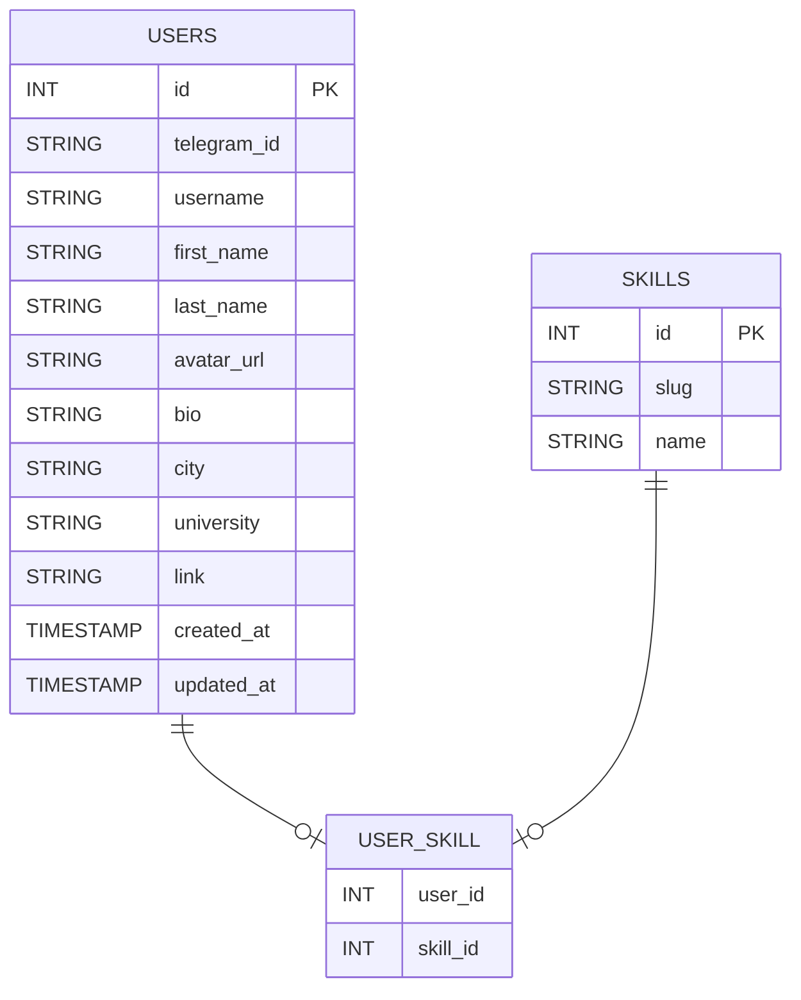

# Backend API

## Описание

Этот проект представляет собой бэкенд для системы управления пользователями и их навыками. Бэкенд использует **FastAPI** для создания RESTful API и **SQLAlchemy** для работы с базой данных. Система реализует авторизацию через **Telegram**, а также предоставляет функционал для работы с профилями пользователей и их навыками.

Основная цель проекта — предоставить API для:
- Аутентификации пользователей через Telegram.
- Управления профилями пользователей.
- Обработки навыков пользователей и их поиска.

## Архитектура

### Стек технологий

- **FastAPI** — высокоскоростной фреймворк для создания API, построенный на стандарте ASGI и Python 3.7+.
- **SQLAlchemy** — ORM для работы с базой данных PostgreSQL.
- **Pydantic** — для валидации данных и автоматической генерации схем API.
- **JWT** — для авторизации и аутентификации.
- **PostgreSQL** — база данных для хранения информации о пользователях и их навыках.
- **Docker** — для контейнеризации и упрощения развертывания.
- **GitHub Actions** — для CI/CD.
- **Mermaid** — для визуализации схем и диаграмм в документации.

### Основные компоненты

1. **API (FastAPI)** — предоставляет интерфейс для взаимодействия с клиентом, включая аутентификацию, получение и обновление данных пользователя, а также выполнение поиска.
2. **Репозитории** — инкапсулируют логику взаимодействия с базой данных для сущностей пользователей и навыков.
3. **Сервис аутентификации** — через Telegram WebApp. Включает в себя валидацию данных и генерацию JWT токенов для авторизации.
4. **Модели данных** — SQLAlchemy ORM используется для отображения таблиц базы данных на Python-классы.

### Архитектурная диаграмма

```mermaid
graph TD;
    A[API запросы] --> B[Роутеры FastAPI]
    B --> C[Сервисы]
    C --> D[Репозитории]
    D --> E[Модели (SQLAlchemy)]
    E --> F[(PostgreSQL)]
    B --> G[JWT авторизация]
    C --> G
    D --> H[Сессии с БД]
```

## Структура проекта

```
/backend
├── /backend/presentations     # API-роутеры и схемы (FastAPI)
│   ├── /routers              # Роутеры для разных частей API (users, auth, system)
│   └── /schemas              # Pydantic-схемы для валидации входных и выходных данных
├── /backend/repositories      # Репозитории для работы с БД (UsersRepo, SkillsRepo)
│   ├── /base.py              # Базовый класс для всех репозиториев
│   ├── /users.py             # Репозиторий для пользователей
│   └── /skills.py            # Репозиторий для навыков
├── /backend/services         # Сервисы для бизнес-логики
│   └── /auth_telegram.py     # Сервис аутентификации через Telegram
├── /backend/utils            # Утилиты, например для работы с JWT и Telegram
│   └── /jwt_simple.py        # Простая утилита для работы с JWT
├── /backend/infrastructure   # Инфраструктура для работы с БД и настройками
│   └── /db.py                # Функции для инициализации и закрытия соединений с БД
├── /backend/settings         # Конфигурационные файлы (например, для JWT, Telegram)
└── /backend/main.py          # Главный файл для создания и запуска FastAPI приложения
```

### Основные компоненты системы

1. **API роутеры**  
   API делится на несколько роутеров:  
   - **/auth** — роуты для аутентификации пользователей через Telegram.
   - **/users** — роуты для работы с профилями пользователей, включая создание и обновление данных.
   - **/system** — системные роуты для проверки состояния сервиса (health, version, ready).

2. **Репозитории**  
   Все операции с базой данных инкапсулированы в репозиториях. Это позволяет изолировать бизнес-логику от логики работы с данными.
   - **UsersRepo** — работа с пользователями.
   - **SkillsRepo** — работа с навыками.

3. **Сервисы**  
   Сервисы реализуют бизнес-логику:
   - **AuthTelegramService** — сервис для валидации данных от Telegram и генерации JWT.
   
4. **Модели данных**  
   Используется **SQLAlchemy** для взаимодействия с базой данных. Таблицы пользователей, навыков и их связи реализованы с помощью моделей.

5. **База данных**  
   Для хранения данных используется **PostgreSQL**. Структура БД следующая:
   - Таблица `users` — хранит информацию о пользователях.
   - Таблица `skills` — хранит данные о навыках.
   - Таблица `user_skill` — связь many-to-many между пользователями и их навыками.

### Диаграмма базы данных



## Разворачивание проекта

### Требования

- Python 3.9+
- Docker (для развертывания в контейнерах)
- PostgreSQL (или Docker контейнер для PostgreSQL)
- Git (для клонирования репозитория)

### Установка

1. Клонируйте репозиторий:

   ```bash
   git clone https://github.com/your-repository/backend.git
   cd backend
   ```

2. Создайте виртуальное окружение:

   ```bash
   python -m venv venv
   source venv/bin/activate  # Для Linux/macOS
   venv\Scriptsctivate     # Для Windows
   ```

3. Установите зависимости:

   ```bash
   pip install -r requirements.txt
   ```

4. Для развертывания базы данных используйте Docker:

   ```bash
   docker-compose up
   ```

5. Запустите приложение:

   ```bash
   uvicorn backend.main:app --reload
   ```

   Ваше приложение будет доступно по адресу `http://localhost:8000`.

6. Если вы хотите развернуть приложение с Docker, используйте команду:

   ```bash
   docker-compose up --build
   ```

7. Для тестирования API вы можете использовать Swagger UI по адресу `http://localhost:8000/docs`.

### Конфигурация

Конфигурация хранится в файле `backend/settings/config.py`, где задаются все основные параметры для работы приложения:

```python
# Пример конфигурации
class Settings:
    APP_NAME: str = "MiniApp API"
    APP_VERSION: str = "1.0.0"
    TELEGRAM_BOT_TOKEN: str = "your-telegram-bot-token"
    JWT_SECRET: str = "your-jwt-secret"
    JWT_TTL_SECONDS: int = 7 * 24 * 3600  # 7 дней
    CORS_ORIGINS_LIST: list = ["*"]

settings = Settings()
```

Настройки можно изменить для различных окружений, например, через переменные окружения.

### Работа с базой данных

Для работы с базой данных используется **SQLAlchemy**. Репозитории инкапсулируют логику работы с таблицами. Для создания базы данных используется Alembic (если требуется миграция).

### CI/CD

Проект настроен для автоматического тестирования и деплоя через **GitHub Actions**. Скрипты для тестирования и деплоя настроены в `.github/workflows`.

## Структура данных

### Пользователь

Модель пользователя включает следующие поля:
- `id` — уникальный идентификатор.
- `telegram_id` — ID пользователя в Telegram.
- `username`, `first_name`, `last_name` — имя и фамилия пользователя.
- `bio` — биография.
- `skills` — список навыков пользователя.

### Навыки

Навыки хранятся в таблице `skills`, которая имеет поля:
- `id` — уникальный идентификатор.
- `slug` — уникальное название для навыка.
- `name` — имя навыка.

### Связь Пользователь-Навыки

Между пользователями и их навыками существует связь many-to-many, которая хранится в таблице `user_skill`. Эта таблица содержит:
- `user_id` — ссылка на пользователя.
- `skill_id` — ссылка на навык.

## API Роуты

### /auth/telegram

**POST** — Авторизация через Telegram. Принимает `init_data` от Telegram WebApp, проверяет подпись и возвращает `access_token`.

**Пример запроса**:
```json
{
  "init_data": "<telegram_init_data>"
}
```

### /users/me

**GET** — Получить профиль текущего пользователя. Требует JWT в заголовке авторизации.

### /users/{user_id}

**GET** — Получить профиль пользователя по ID. Требует JWT в заголовке авторизации.

### /users/me (PATCH)

**PATCH** — Обновить профиль текущего пользователя (например, изменить биографию или добавить ссылку на профиль).

### /users

**GET** — Поиск пользователей. Поддерживает фильтрацию по навыкам и текстовому поиску.

## Заключение

Этот проект предоставляет бэкенд для работы с пользователями, их профилями и навыками. Он построен с использованием современных технологий, таких как FastAPI и SQLAlchemy, что позволяет легко масштабировать систему и интегрировать с другими сервисами.
