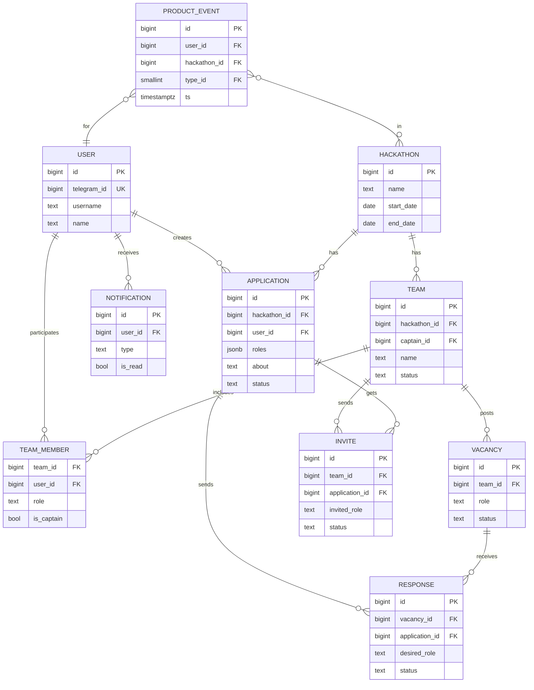

# Логическая модель (ER, Mermaid)

```mermaid
erDiagram
  USER ||--o{ APPLICATION : creates
  USER ||--o{ TEAM_MEMBER : participates
  USER ||--o{ NOTIFICATION : receives

  HACKATHON ||--o{ APPLICATION : "has"
  HACKATHON ||--o{ TEAM : "has"

  TEAM ||--o{ TEAM_MEMBER : "includes"
  TEAM ||--o{ VACANCY : "posts"
  TEAM ||--o{ INVITE : "sends"

  APPLICATION ||--o{ INVITE : "gets"
  APPLICATION ||--o{ RESPONSE : "sends"

  VACANCY ||--o{ RESPONSE : "receives"

  PRODUCT_EVENT }o--|| USER : for
  PRODUCT_EVENT }o--o{ HACKATHON : in

  USER {
    bigint id PK
    bigint telegram_id UK
    text username
    text name
  }

  HACKATHON {
    bigint id PK
    text name
    date start_date
    date end_date
  }

  APPLICATION {
    bigint id PK
    bigint hackathon_id FK
    bigint user_id FK
    jsonb roles
    text about
    text status
  }

  TEAM {
    bigint id PK
    bigint hackathon_id FK
    bigint captain_id FK
    text name
    text status
  }

  TEAM_MEMBER {
    bigint team_id FK
    bigint user_id FK
    text role
    bool is_captain
  }

  VACANCY {
    bigint id PK
    bigint team_id FK
    text role
    text status
  }

  INVITE {
    bigint id PK
    bigint team_id FK
    bigint application_id FK
    text invited_role
    text status
  }

  RESPONSE {
    bigint id PK
    bigint vacancy_id FK
    bigint application_id FK
    text desired_role
    text status
  }

  NOTIFICATION {
    bigint id PK
    bigint user_id FK
    text type
    bool is_read
  }

  PRODUCT_EVENT {
    bigint id PK
    bigint user_id FK
    bigint hackathon_id FK
    smallint type_id FK
    timestamptz ts
  }
```
